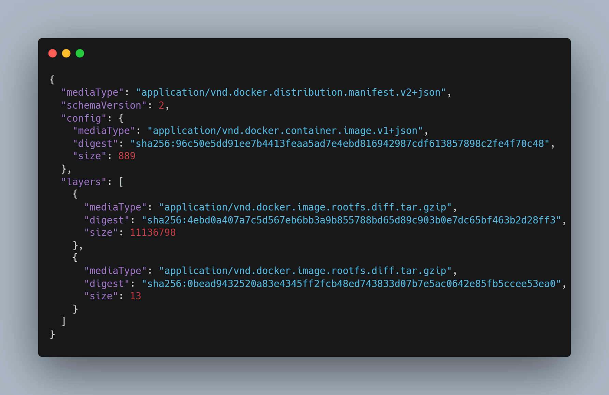
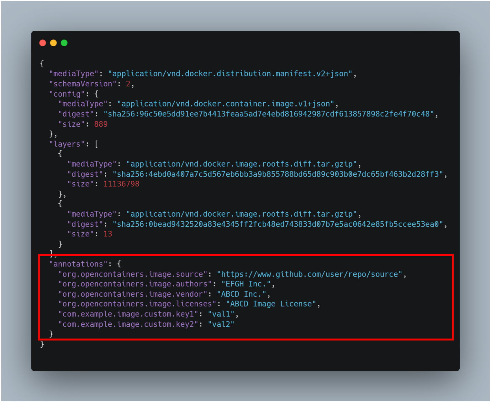
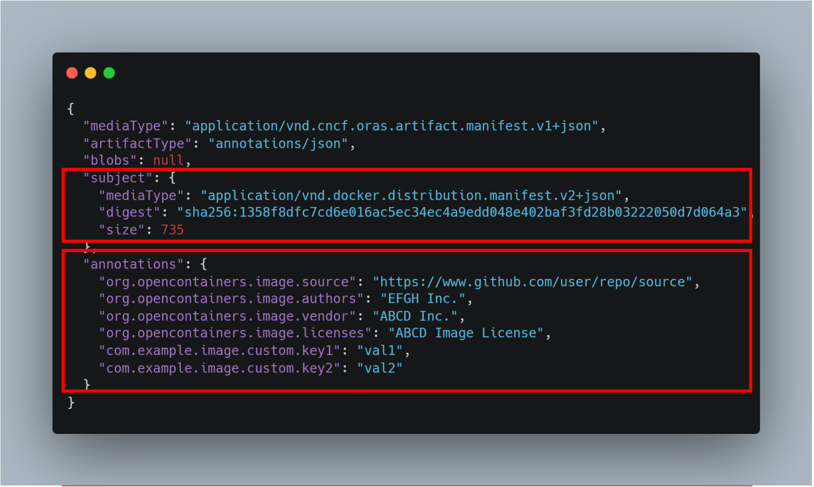
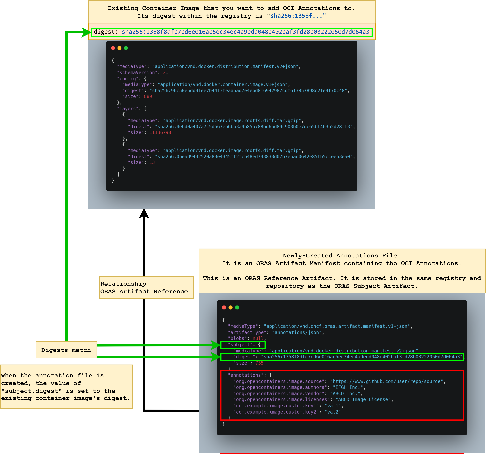

# Annotate Registry Artifacts

Interact with the [OCI annotations](https://github.com/opencontainers/image-spec/blob/main/annotations.md) of an existing registry artifact (such as [container images](https://www.docker.com/resources/what-container/) or [OCI artifacts](https://github.com/opencontainers/artifacts)).

## Commands

### Attach

This command attaches a set of [OCI annotations](https://github.com/opencontainers/image-spec/blob/main/annotations.md) to an existing registry artifact (such as [container images](https://www.docker.com/resources/what-container/) or [OCI artifacts](https://github.com/opencontainers/artifacts)).

#### Attach Command – Background and Overview

Registry artifacts are immutable and cannot be tampered with post-build without changing the artifact digest (such as the `sha256` hash).
As such, directly modifying or adding [OCI annotations](https://github.com/opencontainers/image-spec/blob/main/annotations.md) to an existing registry artifact is not possible after an artifact (such as a container image) is built.

For example, the following is an existing container image that has already been built and stored in a registry.
The container image is shown and represented as a [Docker Image Manifest V2 Schema 2 JSON Image Manifest](https://docs.docker.com/registry/spec/manifest-v2-2/).



It is not possible to directly modify or add OCI annotations to this container image without changing its `sha256` hash digest.

That is, modifying existing registry artifacts and container images to add the following OCI annotations is _**NOT POSSIBLE AFTER AN ARTIFACT OR IMAGE HAS BEEN BUILT**_:



#### Attach Command – Architecture

To work around the tamper-proof `digest` of existing artifacts, the `attach` command is used to conceptually add OCI annotations to existing artifacts (including images) by creating a new registry artifact that refers to the existing artifact.

* The `attach` command creates a separate [ORAS Artifact Manifest](https://github.com/oras-project/artifacts-spec/blob/main/artifact-manifest.md) that contains the [OCI annotations](https://github.com/opencontainers/image-spec/blob/main/annotations.md) passed to the `attach` command.
* The newly-created ORAS Artifact Manifest (containing the OCI annotations) also has its `subject` property set to the `digest` of the existing registry artifact. The existing registry artifact is termed (in ORAS definitions) as a "referenced `subject` artifact".
See [ORAS Artifact Manifest Properties](https://github.com/oras-project/artifacts-spec/blob/main/artifact-manifest.md#oras-artifact-manifest-properties) for more information on the `subject` property.
* The newly-created ORAS Artifact Manifest (containing the OCI annotations) is said to be dependent upon the referenced `subject` artifact (the existing artifact the user wishes to conceptually add annotations to).
* As part of this process, the newly-created ORAS Artifact Manifest (containing the OCI annotations) is pushed to the registry.
It is pushed and stored in _**the same registry and the same repository**_ as the referenced `subject` artifact.

#### Attach Command – Example and Usage

For example, a user wishes to attach [OCI annotations](https://github.com/opencontainers/image-spec/blob/main/annotations.md) to the following container image (shown and represented as a [Docker Image Manifest V2 Schema 2 JSON Image Manifest](https://docs.docker.com/registry/spec/manifest-v2-2/)).

The container image:

* is stored in the registry `"$registry_url"` and the repository `"$repository_name"`.
* has a `$digest` value of `sha256:1358f8dfc7cd6e016ac5ec34ec4a9edd048e402baf3fd28b03222050d7d064a3`


A user runs the following `attach` command to attach OCI annotations.

_**NOTE:**_ [OCI Annotations](https://github.com/opencontainers/image-spec/blob/main/annotations.md) must be string-key string-value pairs separated by a colon and a space (`: `).

```bash
./bin/annotation attach \
  --username "$registry_username" \
  --password "$registry_password" \
  --registry "$registry_url" \
  --subject-repository "$repository_name" \
  --subject-tag-or-digest "$digest" \
  --annotation "org.opencontainers.image.source: https://www.github.com/user/repo/source" \
  --annotation "org.opencontainers.image.authors: EFGH Inc." \
  --annotation "org.opencontainers.image.vendor: ABCD Inc." \
  --annotation "org.opencontainers.image.licenses: ABCD Image License" \
  --annotation "com.example.image.custom.key1: val1" \
  --annotation "com.example.image.custom.key2: val2"
```

When the command is run, the following [ORAS Artifact Manifest](https://github.com/oras-project/artifacts-spec/blob/main/artifact-manifest.md) is created, pushed, and stored in the same registry and repository.

Take note of the `annotations` field and the `subject` field.
Notice how the `subject.digest` value matches the `$digest` specified in the `attach` command earlier.
This newly-created ORAS Artifact Manifest is said to be "referring to" or "pointing to" the subject artifact referenced by the `subject.digest` in the same repository.



The following diagram describes the relationship between the existing artifact (the referenced `subject` artifact) and the newly-created ORAS Artifact Manifest.


